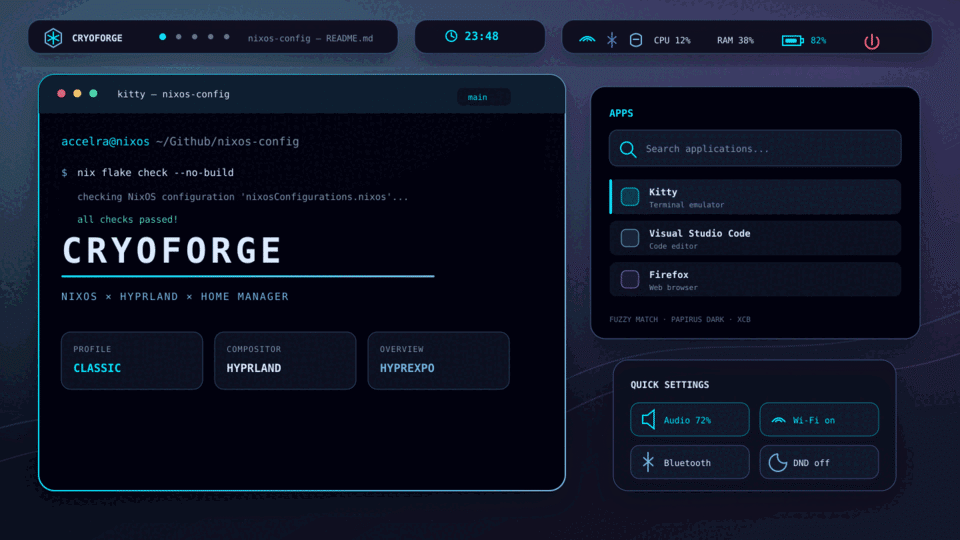
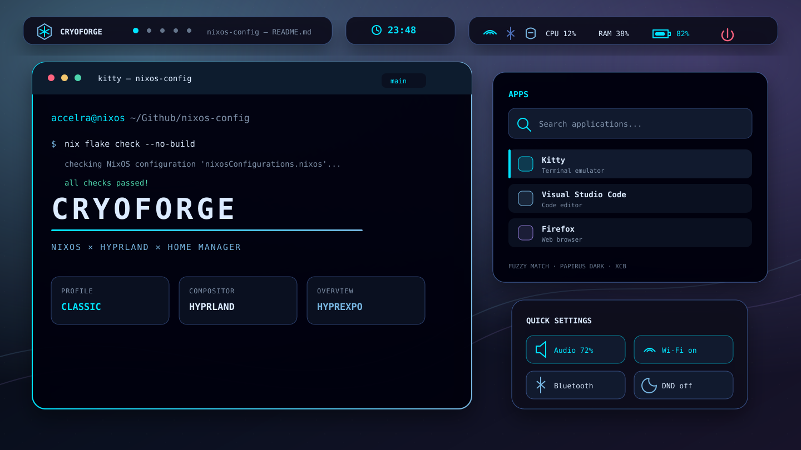
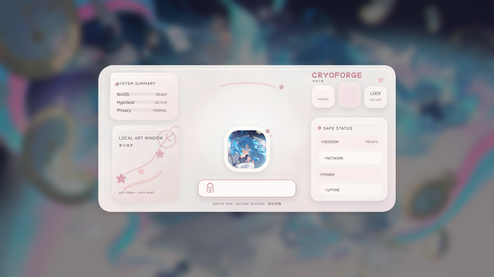

# CryoForge

<p align="center">
  
</p>

<p align="center">
  A declarative NixOS and Hyprland desktop for an ASUS AMD/NVIDIA laptop.<br />
  Dark glass surfaces, ice-blue focus, fast keyboard workflows, and a custom authentication shell.
</p>

<p align="center">
  <code>NixOS 26.05</code> ·
  <code>Hyprland 0.55.4</code> ·
  <code>Home Manager</code> ·
  <code>greetd + ReGreet</code> ·
  <code>x86_64-linux</code>
</p>

> [!IMPORTANT]
> This is a personal, hardware-specific configuration—not a drop-in NixOS
> distribution. Review the username, filesystem UUIDs, NVIDIA PRIME bus IDs,
> ASUS Aura product ID, and private wallpaper paths before building it elsewhere.

## Preview

| Classic desktop | CryoForge login |
|---|---|
|  |  |

The desktop image is a repository-native visualisation of the declared
configuration. The login image is the tracked background composition used by
the custom ReGreet session.

## Highlights

| Area | What is configured |
|---|---|
| **Compositor** | Hyprland with dwindle tiling, rounded windows, gaps, blur, shadows, transparency, gestures, and animated workspace transitions |
| **Shell** | Floating Waybar groups, Mako notifications, hyprpaper, hypridle, and SwayOSD |
| **Launcher** | CryoDeck, a themed Rofi app/run/window launcher using fuzzy matching and Papirus icons |
| **Quick settings** | Rofi panel for audio mute, Wi-Fi, Bluetooth, and Mako Do Not Disturb |
| **Workspace overview** | ABI-pinned Hyprexpo plugin with a three-column native overview |
| **Terminal** | Kitty with the CryoForge palette, background blur, tabs, and JetBrains Mono Nerd Font |
| **Authentication** | Patched ReGreet password-first flow, responsive layout, visible focus states, and a GNOME recovery-session escape hatch |
| **Lock screen** | Custom Hyprlock HUD with time, date, network, battery, uptime, avatar, and password state |
| **Hardware** | AMD display GPU plus NVIDIA PRIME offload, ASUS Aura lighting, `asusd`, and `supergfxd` |
| **Reliability** | Explicit Hyprland session target, guarded portal and Polkit startup, profile conflicts, restart policies, and Caelestia fallback |

## Visual language

The classic shell uses a dark navy base with cool blue hierarchy and neon cyan
for active state. The login and lock experience intentionally shifts into a
softer white-and-rose interface while retaining the CryoForge branding.

| Token | Value | Main use |
|---|---|---|
| Background | `#05070d` | Desktop and terminal foundation |
| Surface | `#0a1020` | Bars, notifications, and panels |
| Raised | `#111a2e` | Selected and elevated controls |
| Deep blue | `#4d6fb7` | Inactive borders and secondary accents |
| Ice blue | `#77b6e1` | Informational and active text |
| Neon cyan | `#00e5ff` | Focus, progress, and primary state |
| Text | `#dcebff` | High-contrast foreground |

The interface is unified through:

- `JetBrainsMono Nerd Font` for the classic shell
- `Bebas Neue`, `Zen Maru Gothic`, and `Tsukimi Rounded` for authentication
- `Papirus-Dark` icons
- `Bibata-Modern-Ice` cursor at 24 px
- 12–16 px radii, restrained borders, and short state transitions

## Desktop profiles

`nixosCryoforge.desktopProfile` controls which shell owns the Hyprland session.

| Profile | Components | Status |
|---|---|---|
| `classic` | Waybar, Mako, hyprpaper, hypridle, SwayOSD | Default and currently selected |
| `caelestia` | Quickshell-based Caelestia shell | Experimental; falls back to `classic` on failure |

Change the profile in [`home.nix`](home.nix), rebuild, and start a new
Hyprland session:

```nix
nixosCryoforge.desktopProfile = "classic";
```

Caelestia is deliberately prevented from rewriting terminal, Hyprland, GTK,
Qt, Discord, Chromium, and other application themes. Profile switching changes
component ownership without surrendering the CryoForge palette.

## Controls

### Launch and session

| Binding | Action |
|---|---|
| <kbd>Super</kbd> + <kbd>T</kbd> | Kitty |
| <kbd>Super</kbd> + <kbd>W</kbd> | Firefox |
| <kbd>Super</kbd> + <kbd>E</kbd> | Thunar |
| <kbd>Super</kbd> + <kbd>C</kbd> | Visual Studio Code |
| <kbd>Super</kbd> + <kbd>D</kbd> | CryoDeck launcher |
| <kbd>Super</kbd> + <kbd>S</kbd> | Quick settings |
| <kbd>Super</kbd> + <kbd>G</kbd> | Hyprexpo workspace overview |
| <kbd>Super</kbd> + <kbd>V</kbd> | Clipboard history |
| <kbd>Super</kbd> + <kbd>L</kbd> | Lock session |
| <kbd>Super</kbd> + <kbd>Shift</kbd> + <kbd>E</kbd> | Exit Hyprland |

### Window and workspace

| Binding | Action |
|---|---|
| <kbd>Super</kbd> + arrow | Move focus |
| <kbd>Super</kbd> + <kbd>Shift</kbd> + arrow | Move window |
| <kbd>Super</kbd> + <kbd>1–0</kbd> | Open workspace 1–10 |
| <kbd>Super</kbd> + <kbd>Alt</kbd> + <kbd>1–0</kbd> | Send window to workspace 1–10 |
| <kbd>Super</kbd> + mouse wheel | Change workspace |
| Three-finger horizontal swipe | Change workspace |
| <kbd>Super</kbd> + left mouse | Move window |
| <kbd>Super</kbd> + right mouse | Resize window |

### Capture and media

| Binding | Action |
|---|---|
| <kbd>Print</kbd> | Select an area and open it in Swappy |
| <kbd>Shift</kbd> + <kbd>Print</kbd> | Save a timestamped full screenshot |
| Audio and brightness keys | Adjust through the themed SwayOSD |
| <kbd>Super</kbd> + <kbd>Shift</kbd> + <kbd>C</kbd> | Pick a color and copy it |

## Architecture

```text
flake.nix
├── configuration.nix
│   ├── hardware-configuration.nix
│   ├── desktop-hyprland.nix
│   └── desktop/regreet/
└── Home Manager
    ├── home.nix
    └── desktop/profiles.nix
        ├── nixos-cryoforge-classic.target
        │   ├── Waybar
        │   ├── Mako
        │   ├── hyprpaper
        │   ├── hypridle
        │   └── SwayOSD
        └── nixos-cryoforge-caelestia.target
            └── Caelestia shell
                └── failure → nixos-cryoforge-classic.target
```

The Hyprland session waits for a valid compositor socket, refreshes the systemd
and D-Bus environment, and then starts profile-owned services. Classic and
Caelestia targets conflict so two bars, notification daemons, or wallpaper
owners cannot run simultaneously.

## Hardware and system choices

- NixOS `26.05` is pinned to a specific release tarball.
- Home Manager follows `release-26.05`.
- Hyprland is the default session; GNOME remains available for recovery.
- GDM is disabled in favour of `greetd + ReGreet`.
- The AMD iGPU owns display output.
- The NVIDIA dGPU uses the open module and PRIME offload.
- Fine-grained NVIDIA power management is enabled.
- NVIDIA Dynamic Boost remains disabled pending hardware validation.
- PipeWire provides ALSA and PulseAudio compatibility.
- NetworkManager, Blueman, GNOME Keyring, CUPS, and XDG portals are enabled.
- Nix garbage collection runs Sundays at 03:15 and retains 30 days.
- Nix store optimisation runs Mondays at 03:45.

## Repository map

```text
.
├── flake.nix
├── configuration.nix
├── hardware-configuration.nix
├── desktop-hyprland.nix
├── home.nix
├── asusd/
│   └── aura_1866.ron
├── desktop/
│   ├── profiles.nix
│   ├── palette.nix
│   ├── wallpaper.svg
│   ├── caelestia/
│   ├── hypr/
│   ├── kitty/
│   ├── mako/
│   ├── regreet/
│   ├── rofi/
│   └── waybar/
├── docs/
│   ├── assets/
│   └── luks-secure-boot-migration.md
└── packages/
    ├── codex.nix
    └── hyprexpo.nix
```

## Build and apply

Clone the repository and inspect the machine-specific values before evaluating
it:

```bash
git clone https://github.com/Acceleratorer/nixos-config.git
cd nixos-config
```

```bash
# Evaluate the flake without building outputs
nix flake check --no-build

# Preview activation changes
sudo nixos-rebuild dry-activate --flake .#nixos

# Build without changing the running system
sudo nixos-rebuild build --flake .#nixos

# Apply the new generation
sudo nixos-rebuild switch --flake .#nixos
```

Update pinned inputs deliberately:

```bash
nix flake update
nix flake check
```

## Security status

The custom greeter says **SECURE SESSION**, which describes the PAM login
boundary. It does not claim that firmware Secure Boot or full-disk encryption
is active.

The current baseline still uses:

- plain ext4 for `/`
- a plain swap partition
- systemd-boot with firmware Secure Boot disabled

The staged migration and recovery checklist lives in
[`docs/luks-secure-boot-migration.md`](docs/luks-secure-boot-migration.md).

## Known limitations

- The active desktop wallpaper, lock background, lock overlay, and avatar live
  under `/home/accelra/.local/share/wallpapers/cryoforge/current/` and are not
  tracked. A clean checkout can generate the Caelestia fallback wallpaper, but
  the classic wallpaper and complete personal lock screen are not reproducible.
- Hyprlock positioning and the personal artwork are tuned for a 1920×1080
  display.
- [`desktop/palette.nix`](desktop/palette.nix) documents the intended color
  tokens, but components still duplicate their color values directly.
- Rofi uses its XCB backend under XWayland because the native Wayland teardown
  path in the packaged Rofi version is unstable on this configuration.
- The ReGreet package carries local patches and source overrides, so upstream
  upgrades require a deliberate compatibility review.

## Declaratively installed tools

The system configuration includes Firefox, Brave, Visual Studio Code, Discord,
Git, GitHub CLI, Node.js, Codex CLI, Bubblewrap, archive utilities, ASUS
controls, and the desktop utilities required by the Hyprland workflow.

The NixOS launcher mark in Waybar comes from the official NixOS branding
repository and retains its CC BY 4.0 attribution in
[`desktop/waybar/assets/README.md`](desktop/waybar/assets/README.md).
